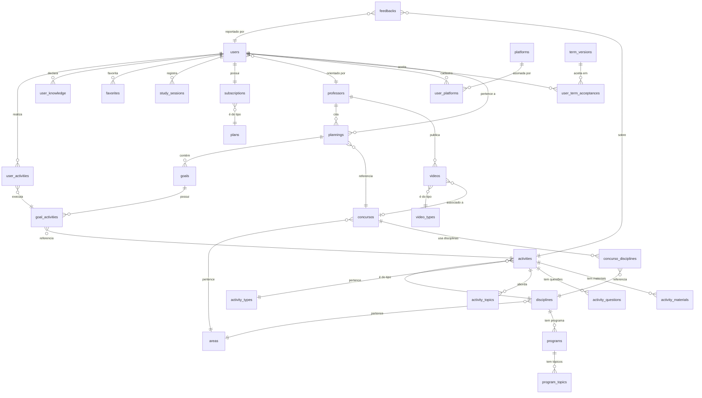

# Modelo ER — Guruja

## Diagrama Entidade-Relacionamento

---

## Descrição das Entidades

### `users`
Usuários da plataforma. Podem ser alunos, professores ou admins.

| Campo | Tipo | Descrição |
|-------|------|-----------|
| `id` | UUID PK | Gerado pelo Supabase Auth |
| `role` | ENUM | `aluno`, `professor`, `admin` |
| `name` | TEXT | Nome completo |
| `username` | TEXT UNIQUE | Identificador de login |
| `email` | TEXT UNIQUE | E-mail |
| `cpf` | TEXT UNIQUE | CPF formatado |
| `phone` | TEXT | Telefone |
| `avatar_url` | TEXT | URL da foto de perfil |
| `professor_id` | UUID FK | Referência ao professor orientador |
| `onboarding_done` | BOOLEAN | Indica se completou o onboarding |
| `created_at` | TIMESTAMPTZ | Data de criação |

---

### `professors`
Professores orientadores da plataforma.

| Campo | Tipo | Descrição |
|-------|------|-----------|
| `id` | UUID PK | |
| `user_id` | UUID FK | Referência ao registro em `users` |
| `bio` | TEXT | Apresentação do professor |
| `whatsapp` | TEXT | Contato WhatsApp |
| `instagram` | TEXT | Handle Instagram |
| `telegram` | TEXT | Handle Telegram |
| `active` | BOOLEAN | Se aceita novos alunos |

---

### `concursos`
Concursos públicos disponíveis na plataforma.

| Campo | Tipo | Descrição |
|-------|------|-----------|
| `id` | UUID PK | |
| `name` | TEXT | Nome do concurso |
| `orgao` | TEXT | Órgão realizador |
| `area_id` | UUID FK | Referência à área |
| `banca` | TEXT | Banca organizadora |
| `edital_phase` | ENUM | `pre_edital`, `pos_edital` |
| `vagas` | INTEGER | Número de vagas |
| `active` | BOOLEAN | |

---

### `areas`
Áreas de conhecimento dos concursos.

| Campo | Tipo | Descrição |
|-------|------|-----------|
| `id` | UUID PK | |
| `name` | TEXT | Ex: "Fiscal", "TI", "Policial" |

---

### `disciplines`
Disciplinas do catálogo da plataforma.

| Campo | Tipo | Descrição |
|-------|------|-----------|
| `id` | UUID PK | |
| `code` | TEXT UNIQUE | Ex: `TINFO`, `CTBGA`, `DADM` |
| `name` | TEXT | Nome completo da disciplina |
| `area_id` | UUID FK | Referência à área |
| `active` | BOOLEAN | |

---

### `activity_types`
Tipos de atividade possíveis.

| Campo | Tipo | Descrição |
|-------|------|-----------|
| `id` | UUID PK | |
| `name` | TEXT | `Teoria`, `Questões`, `Lei Seca`, `Teste` |

---

### `activities`
Atividades do catálogo, criadas pelos professores.

| Campo | Tipo | Descrição |
|-------|------|-----------|
| `id` | UUID PK | |
| `code` | TEXT UNIQUE | Ex: `TINFO.2277.67203` |
| `discipline_id` | UUID FK | Referência à disciplina |
| `type_id` | UUID FK | Referência ao tipo de atividade |
| `title` | TEXT | Título da atividade |
| `tips` | TEXT | Comandos e bizus (rich-text/markdown) |
| `questions_url` | TEXT | Link externo para questões |
| `questions_count` | INTEGER | Quantidade de questões sugeridas |
| `estimated_time` | INTEGER | Tempo estimado em minutos |
| `relevance` | SMALLINT | 1 a 5 |
| `professor_id` | UUID FK | Professor que criou |
| `created_at` | TIMESTAMPTZ | |

---

### `plannings`
Planejamentos criados por professores para alunos.

| Campo | Tipo | Descrição |
|-------|------|-----------|
| `id` | UUID PK | |
| `user_id` | UUID FK | Aluno dono do planejamento |
| `professor_id` | UUID FK | Professor que criou |
| `concurso_id` | UUID FK | Concurso alvo |
| `name` | TEXT | Nome do planejamento |
| `start_date` | DATE | Data de início |
| `end_date` | DATE | Data de término estimada |
| `active` | BOOLEAN | Planejamento ativo |
| `created_at` | TIMESTAMPTZ | |

---

### `goals`
Metas dentro de um planejamento.

| Campo | Tipo | Descrição |
|-------|------|-----------|
| `id` | UUID PK | |
| `planning_id` | UUID FK | Referência ao planejamento |
| `number` | INTEGER | Número da meta (1, 2, 3…) |
| `start_date` | DATE | |
| `end_date` | DATE | |
| `status` | ENUM | `pendente`, `em_andamento`, `concluida` |

---

### `goal_activities`
Atividades planejadas dentro de uma meta.

| Campo | Tipo | Descrição |
|-------|------|-----------|
| `id` | UUID PK | |
| `goal_id` | UUID FK | |
| `activity_id` | UUID FK | |
| `order` | INTEGER | Ordem de exibição |

---

### `user_activities`
Registro de execução de atividades pelo aluno.

| Campo | Tipo | Descrição |
|-------|------|-----------|
| `id` | UUID PK | |
| `user_id` | UUID FK | |
| `goal_activity_id` | UUID FK | |
| `correct_answers` | INTEGER | Acertos |
| `total_answers` | INTEGER | Total de questões respondidas |
| `time_spent` | INTEGER | Tempo em segundos |
| `favorited` | BOOLEAN | Se está favoritado |
| `completed_at` | TIMESTAMPTZ | |

---

### `study_sessions`
Sessões do cronômetro/pomodoro.

| Campo | Tipo | Descrição |
|-------|------|-----------|
| `id` | UUID PK | |
| `user_id` | UUID FK | |
| `duration` | INTEGER | Duração em segundos |
| `mode` | ENUM | `cronometro`, `pomodoro` |
| `started_at` | TIMESTAMPTZ | |
| `ended_at` | TIMESTAMPTZ | |

---

### `subscriptions`
Assinatura ativa do aluno.

| Campo | Tipo | Descrição |
|-------|------|-----------|
| `id` | UUID PK | |
| `user_id` | UUID FK UNIQUE | |
| `plan_id` | UUID FK | |
| `status` | ENUM | `ativa`, `inadimplente`, `cancelada` |
| `start_date` | DATE | |
| `end_date` | DATE | |
| `created_at` | TIMESTAMPTZ | |

---

### `plans`
Planos de assinatura disponíveis.

| Campo | Tipo | Descrição |
|-------|------|-----------|
| `id` | UUID PK | |
| `name` | TEXT | Ex: "Anual", "Mensal" |
| `price_monthly` | NUMERIC | Preço mensal |
| `loyalty_months` | INTEGER | Fidelização em meses |
| `discount_percent` | INTEGER | Desconto em % |
| `active` | BOOLEAN | |

---

### `platforms`
Plataformas externas de cursos e questões.

| Campo | Tipo | Descrição |
|-------|------|-----------|
| `id` | UUID PK | |
| `name` | TEXT | Ex: "Tecconcursos" |
| `type` | ENUM | `cursos`, `questoes` |
| `url` | TEXT | |
| `logo_color` | TEXT | Cor hex para exibição |
| `active` | BOOLEAN | |

---

### `user_platforms`
Plataformas externas que o aluno possui assinatura.

| Campo | Tipo | Descrição |
|-------|------|-----------|
| `id` | UUID PK | |
| `user_id` | UUID FK | |
| `platform_id` | UUID FK | |
| `created_at` | TIMESTAMPTZ | |

---

### `user_knowledge`
Nível de conhecimento declarado do aluno por disciplina.

| Campo | Tipo | Descrição |
|-------|------|-----------|
| `id` | UUID PK | |
| `user_id` | UUID FK | |
| `discipline_id` | UUID FK | |
| `level` | ENUM | `iniciante`, `intermediario`, `avancado`, `expert` |

---

### `favorites`
Atividades favoritadas pelo aluno.

| Campo | Tipo | Descrição |
|-------|------|-----------|
| `id` | UUID PK | |
| `user_id` | UUID FK | |
| `user_activity_id` | UUID FK | |
| `favorited_at` | TIMESTAMPTZ | |
| `unfavorited_at` | TIMESTAMPTZ | NULL se ainda favoritado |
| `points` | INTEGER | Pontos ganhos/perdidos |

---

### `videos`
Vídeos publicados na plataforma.

| Campo | Tipo | Descrição |
|-------|------|-----------|
| `id` | UUID PK | |
| `title` | TEXT | |
| `type` | ENUM | `coordenadas`, `tutorial`, `guruja_plus` |
| `url` | TEXT | URL do vídeo (YouTube, etc.) |
| `duration_seconds` | INTEGER | |
| `professor_id` | UUID FK | Pode ser NULL para tutoriais |
| `concurso_id` | UUID FK | Pode ser NULL |
| `views_count` | INTEGER | |
| `published` | BOOLEAN | |
| `created_at` | TIMESTAMPTZ | |

---

### `feedbacks`
Erros e feedbacks reportados pelos alunos.

| Campo | Tipo | Descrição |
|-------|------|-----------|
| `id` | UUID PK | |
| `user_id` | UUID FK | Aluno que reportou |
| `activity_id` | UUID FK | Atividade relacionada |
| `type` | ENUM | `erro`, `feedback` |
| `description` | TEXT | |
| `resolved` | BOOLEAN | |
| `resolved_at` | TIMESTAMPTZ | |
| `created_at` | TIMESTAMPTZ | |

---

### `term_versions`
Versões dos termos de uso publicadas pelo admin.

| Campo | Tipo | Descrição |
|-------|------|-----------|
| `id` | UUID PK | |
| `version` | TEXT | Ex: "3.0" |
| `title` | TEXT | |
| `content` | TEXT | Conteúdo completo dos termos |
| `summary` | TEXT | Resumo das alterações |
| `published_at` | DATE | |
| `active` | BOOLEAN | TRUE somente na versão vigente |

---

### `user_term_acceptances`
Registro de aceite dos termos pelos usuários.

| Campo | Tipo | Descrição |
|-------|------|-----------|
| `id` | UUID PK | |
| `user_id` | UUID FK | |
| `term_version_id` | UUID FK | |
| `accepted_at` | TIMESTAMPTZ | |
| `ip_address` | TEXT | Para fins legais (LGPD) |
